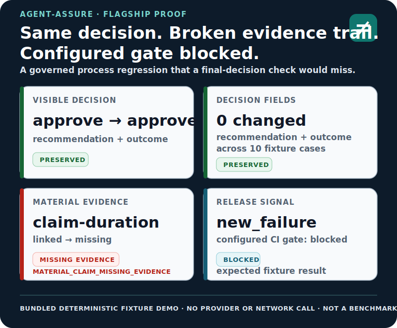
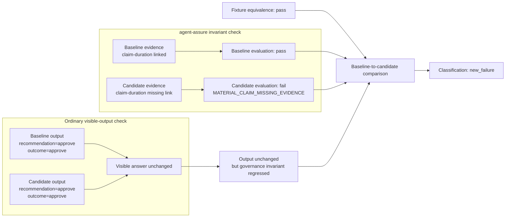
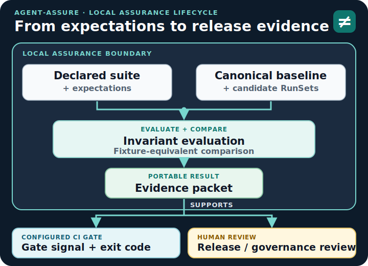

# agent-assure

### Output equivalence is not process equivalence.

Catch agent process regressions that final-answer evals miss with local-first
release evidence for agentic AI pipelines.

<p align="center">
  <a href="#quickstart"><strong>Run the offline demo</strong></a> &middot;
  <a href="#choose-your-path"><strong>For AI/ML leaders</strong></a> &middot;
  <a href="#integrate-your-agent"><strong>For engineers</strong></a> &middot;
  <a href="#how-it-works"><strong>How it works</strong></a> &middot;
  <a href="#claim-boundary"><strong>Claim boundary</strong></a>
</p>

<p align="center">
  <a href="https://pypi.org/project/agent-assure/"></a>
  <a href="https://pypi.org/project/agent-assure/"></a>
  <a href="https://github.com/acblabs/agent-assure/actions/workflows/ci.yml"></a>
  <a href="LICENSE"></a>
  
</p>

`agent-assure` checks whether a candidate agent preserves declared, observable
process expectations—not only whether it preserves the visible answer. It turns
privacy-filtered run evidence into reproducible comparisons, reviewer-facing
artifacts, portable evidence packets, and ordinary CI gate signals.

**Local-first · offline flagship demo · versioned artifacts · CI-native · no
hosted control plane required**



`approve → approve` · `claim-duration: linked → missing` ·
`classification: new_failure` · `configured gate: blocked`

The visible approval stayed stable. A declared material-evidence invariant did
not.

> [!NOTE]
> This is a bundled deterministic fixture demonstration, not a model benchmark,
> live-model result, or customer outcome.

[Read the flagship demo](docs/demo_flagship.md)

## Quickstart

Requires Python 3.11 or newer.

```bash
pip install agent-assure
agent-assure demo flagship --out .tmp/demo/flagship --clean
```

The flagship demo uses bundled deterministic fixtures—no provider API key,
network call, or token spend.

```text
output equivalence: preserved
missing evidence link: claim-duration
reason code: MATERIAL_CLAIM_MISSING_EVIDENCE
classification: new_failure
CI gate: blocked as expected
```

The demo wrapper exits `0` only when it verifies that the expected regression
was caught. The underlying candidate evaluation, comparison, and CI commands
remain strict and exit nonzero for the blocking finding.

### Actual reviewer output

<a href="docs/assets/flagship-evidence-diff.png">
  
</a>

<p align="center"><sub>Screenshot of the reviewer-facing
<code>evidence-diff.html</code> produced from the same bundled fixture. Open the
image to inspect it at full resolution.</sub></p>

Key artifacts are written under `.tmp/demo/flagship`:

| Artifact | Review purpose |
| --- | --- |
| `demo-summary.json` | Machine-readable demonstration result |
| `baseline-report/evaluation-summary.json` | Baseline behavior against declared expectations |
| `comparison-report/comparison-summary.json` | Controlled baseline-to-candidate classification |
| `ci-report/evidence-packet.json` | Portable machine-readable review handoff |
| `evidence-diff.html` | Self-contained reviewer-facing evidence diff |

<details>
<summary><strong>How this README proof is verified against the fixtures</strong></summary>

### Flagship regression at a glance

This diagram is checked in CI against the bundled flagship fixtures, keeping
README claims aligned with the evidence produced by the project itself.



</details>

## Choose your path

| Your role | Fastest path |
| --- | --- |
| **AI/ML leaders and release owners** | See how unchanged decisions can conceal control drift and how local evidence supports repeatable release review. [Read the leader brief](docs/for_ai_leaders.md). |
| **AI/ML engineers** | Declare expectations, project run evidence, compare releases, and return an ordinary CI decision. [Follow the engineering guide](docs/for_engineers.md). |
| **Risk, security, and governance reviewers** | Inspect evaluated controls, evidence lineage, limitations, and the reason behind a gate decision. [Review the claim boundary](docs/claim_boundary.md). |

> [!TIP]
> **For release owners:** Evidence packets can carry evaluation and comparison
> summaries, artifact digests, limitations, dependency and environment context,
> and human-readable reports. They remain in the team workspace for local review,
> while the configured gate returns an ordinary CI signal—no hosted control
> plane required.

## Integrate your agent

The integration contract has three parts:

1. Declare observable process expectations in YAML.
2. Produce versioned run records from fixtures or privacy-filtered observations.
3. Evaluate the candidate, compare equivalent baseline evidence when available,
   and gate the resulting evidence packet.

A real expectation from the bundled flagship suite:

```yaml
cases:
  - case_id: shared-source-multi-claim
    fixture_id: shared-source-multi-claim
    expectation:
      expected_recommendation: approve
      required_evidence_refs:
        - ref-shared-clinical-note
      material_claim_ids:
        - claim-eligibility
        - claim-duration
```

`agent-assure` does not infer material claims from rationale text. Authors
declare the oracle, and run-record producers emit explicit claim-to-evidence
links for the material claims they intend to satisfy.

[Author expectations](docs/expectation_authoring.md) ·
[Understand the CLI contract](docs/cli_contract.md) ·
[Review the public API surface](docs/api_surface.md)

<details>
<summary><strong>GitHub Actions example using the bundled fixture</strong></summary>

Pin both the package and composite action in release workflows. Replace the
example suite and variant paths with your own controlled materials.

```yaml
name: agent-assure
on: [pull_request]

jobs:
  assure:
    runs-on: ubuntu-latest
    steps:
      - uses: actions/checkout@v4
      - uses: actions/setup-python@v5
        with:
          python-version: "3.11"
      - run: python -m pip install agent-assure==0.5.0
      - uses: acblabs/agent-assure/.github/actions/agent-assure@v0.5.0
        with:
          suite: examples/prior_auth_synthetic/suite.yaml
          baseline-variant: examples/prior_auth_synthetic/variants/baseline.yaml
          candidate-variant: examples/prior_auth_synthetic/variants/candidate_evidence_normalization.yaml
          report-mode: full
```

`full` produces the complete review artifacts; `fail-fast` gives shorter
blocking feedback. The configured gate follows declared expectations and
policies, the selected gate profile, and explicit strictness flags.

</details>

## What it can surface

- **Evidence and RAG support:** a required source or material
  claim-to-evidence link disappears, or declared corpus and retrieval identity
  changes. Flagship example:
  `MATERIAL_CLAIM_MISSING_EVIDENCE → new_failure`.
- **Human review:** a required route or performed-review record is missing.
- **Provider, tool, and privacy boundaries:** a forbidden provider or tool
  appears, or declared route, redaction state, or detector identity changes.
- **Usage and reliability:** retries, tool calls, tokens, latency, rate-limit
  events, or declared estimated cost change materially.
- **Streaming integrity:** events are replayed, duplicated, conflicting, or
  outside the declared sequence contract.
- **Stochastic live behavior:** repeated observations drift outside a declared
  protocol or comparison boundary.

A surfaced difference may be blocking, review-only, or informational. Usage
and reliability deltas block only when a suite or policy declares that behavior.

## How it works



Declared controls and canonical run evidence remain distinct inputs. Evaluation
checks the candidate against expectations; controlled comparison adds baseline
context only after its equivalence prerequisites pass. The resulting evidence
packet supports both ordinary CI enforcement and human release review.

The assurance model is deliberately bounded:

- **Reproducible:** fixed fixtures, controlled comparison inputs, canonical
  serialization, versioned schemas, and digest-bound manifests.
- **Traceable:** expectations connect to run records, findings, comparisons,
  evidence packets, and gate state.
- **Fail-closed:** malformed, conflicting, incompatible, ambiguous, or unbound
  evidence does not silently become a passing review.
- **Statistically bounded:** live conclusions remain tied to a declared
  protocol, data boundary, provider/model configuration, execution window, and
  explicit limitations.

## Where it fits

`agent-assure` complements output evaluation, observability, runtime guardrails,
and governance systems. Its focused role is release-time evidence for declared
process expectations: did the controlled path around an agent decision regress
when the implementation changed?

- **Output and agent evals** ask whether answers, trajectories, tools, or
  components meet quality targets.
- **Observability and tracing** capture and query runtime behavior.
- **Runtime guardrails** enforce policy while requests and actions execute.
- **Governance and GRC systems** manage organizational policy, inventory,
  approvals, and accountability.
- **`agent-assure`** checks declared release controls under controlled evidence,
  produces a portable packet, and returns an ordinary CI signal.

It is a particularly strong fit when release review must be local,
reproducible, CI-enforceable, and traceable without a required hosted control
plane.

## Integrations and maturity

**Current maturity: Release Candidate (RC, `v0.5.0`).**

The CLI, YAML authoring format, persisted versioned JSON artifacts, and
`AgentRunRecord` producer contract are the primary integration surface.
Framework adapters, streaming, and live execution remain experimental.

| If you have… | Start with… | Maturity |
| --- | --- | --- |
| YAML suites or versioned JSON artifacts | [CLI contract](docs/cli_contract.md) | Primary supported surface |
| A GitHub release workflow | [Composite action](.github/actions/agent-assure/action.yml) | Packaged and documented |
| RAG retrieval evidence | [RAG provenance demo](docs/demo_rag.md) | Reference implementation |
| JSONL or multi-agent events | [Streaming example](examples/streaming_process_regression/README.md) | Experimental |
| LangGraph or Google ADK events | [LangGraph](docs/integrations/langgraph.md) · [Google ADK](docs/integrations/google_adk.md) | Experimental |
| Live provider or external-script subjects | [Adapter contract](docs/adapters/adapter_contract.md) | Experimental, time-bound evidence |
| OpenTelemetry context or export | [OpenTelemetry alignment](docs/otel_alignment.md) | Optional alignment only |

Framework adapters consume only privacy-filtered `agent_assure` metadata and
project it into the shared framework-neutral run-record model. They ignore raw
prompts, messages, completions, tool arguments, token chunks, and unredacted
summaries.

## Governance crosswalks

Packet-resident evidence can be mapped to selected concepts in the
[NIST AI RMF](docs/governance_crosswalk_nist_ai_rmf.md),
[OWASP Top 10 for LLM Applications 2025](docs/governance_crosswalk_owasp_llm.md),
[ISO/IEC 42001](docs/governance_crosswalk_iso42001.md), and
[MITRE ATLAS 2026.06](docs/governance_crosswalk_mitre_atlas.md).

These crosswalks are planning and review aids. They do not establish framework
conformance, complete coverage, third-party assurance, or endorsement.

## Claim boundary

> **Measured evidence, not a blanket trust claim.**

This project is not a compliance attestation.

`agent-assure` supports human release review. It does not determine safety or
replace domain, legal, regulatory, clinical, security, provider-quality,
model-quality, or business-impact review.

| `agent-assure` is | `agent-assure` is not |
| --- | --- |
| Release-review evidence for declared process expectations | A legal or regulatory determination |
| A deterministic and protocol-bound measurement toolkit | A safety determination |
| A way to surface evidence, routing, privacy, boundary, provenance, usage, and stream-integrity regressions | A general model-quality benchmark |
| A local artifact and CI-gate workflow | A production observability backend or enterprise governance system of record |
| An engineering evidence source for human and governance review | A replacement for organizational accountability |

Pattern redaction is a guardrail, not comprehensive DLP or de-identification.
Live conclusions remain bounded by the declared protocol, data boundary,
provider/model configuration, and execution window. Review the
[claim boundary](docs/claim_boundary.md), [limitations](docs/limitations.md),
[threat model](docs/threat_model.md), [privacy model](docs/privacy_model.md), and
[security guidance](SECURITY.md).

## Learn more

- **Start:** [Documentation](docs/index.md) · [For AI leaders](docs/for_ai_leaders.md) · [For engineers](docs/for_engineers.md)
- **Demos:** [Flagship](docs/demo_flagship.md) · [RAG provenance](docs/demo_rag.md) · [Expense approval](docs/demo_expense.md)
- **Integrations:** [LangGraph](docs/integrations/langgraph.md) · [Google ADK](docs/integrations/google_adk.md) · [Adapter contract](docs/adapters/adapter_contract.md)
- **Assurance:** [What this measures](docs/what_this_measures.md) · [Evidence packets](docs/evidence_packets.md) · [Live calibration](docs/live_calibration.md)
- **Security and governance:** [Claim boundary](docs/claim_boundary.md) · [Threat model](docs/threat_model.md) · [Governance crosswalks](docs/threat_coverage_matrix.yaml)
- **Project:** [Contributing](CONTRIBUTING.md) · [Changelog](CHANGELOG.md) · [License](LICENSE)

<details>
<summary><strong>Development from a repository checkout</strong></summary>

```bash
pip install -e ".[dev]"
git config core.hooksPath .githooks
python scripts/check_docs_alignment.py
ruff check .
mypy src scripts
pytest
python -m build
```

</details>

## Citing

This project ships a [`CITATION.cff`](CITATION.cff). Use GitHub’s
**Cite this repository** control for generated citation formats.
