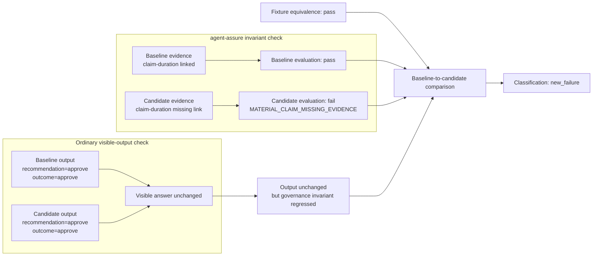
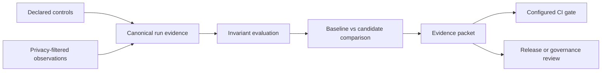

# agent-assure

### Local-first process assurance and release evidence for AI agents

<p align="center">
  <a href="#quickstart"><strong>Quickstart</strong></a> &middot;
  <a href="#where-it-fits"><strong>Where it fits</strong></a> &middot;
  <a href="#assurance-model"><strong>Assurance model</strong></a> &middot;
  <a href="#integrations-and-maturity"><strong>Integrations</strong></a> &middot;
  <a href="#claim-boundary"><strong>Claim boundary</strong></a>
</p>

<p align="center">
  <a href="https://pypi.org/project/agent-assure/"></a>
  <a href="https://pypi.org/project/agent-assure/"></a>
  <a href="https://github.com/acblabs/agent-assure/actions/workflows/ci.yml"></a>
  <a href="LICENSE"></a>
  
</p>

**Same answer. Different process. Catch the regression before it ships.**

`agent-assure` verifies whether an agent change preserves declared process
controls—not only the visible answer. It turns privacy-filtered run evidence
into controlled baseline-to-candidate comparisons, human-readable evidence
diffs, portable evidence packets, and CI gate signals.

> **Core thesis:** Output equivalence is not process equivalence.

**Surface regressions in:** evidence links · RAG provenance · human-review
routing · provider and tool boundaries · privacy and redaction state · retries
and usage · streaming event integrity

```text
baseline decision:       approve
candidate decision:      approve
output-only check:       pass

required evidence link:  missing
classification:          new_failure
configured CI gate:      blocked
```

**The answer did not change. The governed process did.**


<sub>The visible approval stayed stable, but the material evidence trail
regressed and the configured release gate blocked the candidate.</sub>

<details>
<summary><strong>Verified flagship regression graph</strong></summary>

### Flagship regression at a glance

This diagram is checked in CI against the bundled flagship fixtures, keeping
README claims aligned with the evidence produced by the project itself.



</details>

## Quickstart

```bash
pip install agent-assure
agent-assure demo flagship
```

The flagship demo runs against bundled deterministic fixtures—no provider API
key, network call, or token spend. It writes local review artifacts under
`.tmp/demo/flagship`, including the static `evidence-diff.html` report shown
above.

```text
visible decision: preserved
material evidence: missing
classification: new_failure
CI gate: blocked
```

### GitHub Actions example

Pin both the package and composite action in release workflows:

```yaml
name: agent-assure
on: [pull_request]

jobs:
  assure:
    runs-on: ubuntu-latest
    steps:
      - uses: actions/checkout@v4
      - uses: actions/setup-python@v5
        with:
          python-version: "3.11"
      - run: python -m pip install agent-assure==0.5.0
      - uses: acblabs/agent-assure/.github/actions/agent-assure@v0.5.0
        with:
          suite: examples/prior_auth_synthetic/suite.yaml
          baseline-variant: examples/prior_auth_synthetic/variants/baseline.yaml
          candidate-variant: examples/prior_auth_synthetic/variants/candidate_evidence_normalization.yaml
          report-mode: full
```

`full` produces the complete review artifacts; `fail-fast` gives shorter
blocking feedback. The bundled candidate is intentionally expected to fail
because its declared blocking invariant is violated. More generally, the
configured gate follows declared expectations and policies, the selected gate
profile, and explicit strictness flags.

<details>
<summary><strong>Additional offline demos</strong></summary>

Run the RAG provenance and broader process-measurement fixtures:

```bash
agent-assure demo rag --out .tmp/demo/rag --clean
agent-assure demo measurement-cases --out .tmp/measurement-cases --clean
```

From a repository checkout, ingest and evaluate the streaming JSONL example:

```bash
agent-assure stream ingest examples/streaming_process_regression/events/candidate_evidence_removed.jsonl --sequence-scope global --out .tmp/streaming/stream-run.json
agent-assure stream evaluate .tmp/streaming/stream-run.json --suite examples/streaming_process_regression/suite.yaml --out-dir .tmp/streaming/report
```

See the [streaming example](examples/streaming_process_regression/README.md)
for its sequencing, duplicate, and arrival-jitter contract.

Run the framework examples from the repository root:

```bash
python examples/langgraph_expense_assurance/run_example.py
python examples/adk_process_assurance/run_example.py
```

> Both framework examples run without provider calls or token spend. The
> LangGraph example also has a deterministic fallback when LangGraph is not
> installed. The Google ADK example runs from a synthetic ADK event transcript.

</details>

## Where it fits

`agent-assure` does not replace output evaluation, observability, runtime
guardrails, or enterprise governance. It supplies a focused release-review
layer for declared process controls and portable engineering evidence.

| Category | Primarily optimized for | Where `agent-assure` adds value |
| --- | --- | --- |
| **Output and agent evals** | Scoring responses, trajectories, tool use, components, and datasets | Declared process invariants, fixture-equivalent comparisons, digest-bound evidence lineage, and explicit release-gate semantics |
| **Observability and tracing** | Capturing, querying, visualizing, and monitoring runtime behavior | Converts privacy-filtered observations into controlled release-review evidence; it is not trying to be the production trace warehouse |
| **Governance and GRC** | AI inventory, policies, approvals, risk workflows, organizational controls, and audit programs | Supplies engineering-side release evidence that can feed governance workflows; it is not the enterprise system of record |
| **Runtime guardrails** | Enforcing policy during requests, tool calls, or agent actions | Tests whether a candidate release preserved declared boundaries, evidence requirements, and review behavior before deployment |
| **`agent-assure`** | **Local process-regression assurance at change and release time** | **Expectation-driven comparisons, portable evidence packets, and CI-native gate decisions** |

`agent-assure` is a particularly strong fit when the release decision must be
local, reproducible, CI-enforceable, and traceable to declared controls.

It converts declared controls and controlled run evidence into a local,
reproducible, digest-bound release decision with ordinary CI enforcement and
no required hosted control plane.

## Built for release owners and builders

| AI and ML leaders | AI and ML engineers |
| --- | --- |
| Surface silent process drift that unchanged final answers can conceal | Declare process expectations in YAML |
| Establish repeatable change control for agent releases | Run deterministic offline fixtures |
| Review portable evidence instead of relying on screenshots or anecdotes | Compare baseline and candidate runs under equivalent inputs |
| Connect engineering evidence to governance and release review | Project framework events into strict run records |
| Preserve review artifacts in the team’s workspace | Produce JSON, Markdown, static HTML, and ordinary CI exit codes |
| Understand the limits and uncertainty of stochastic live evidence | Use protocol-bound repeated runs and statistical summaries |

Security and governance reviewers can inspect which controls were evaluated,
which evidence supported each finding, which artifacts and detector profiles
were used, and why the configured gate passed or failed.

## What it catches

| Surface | Example process regression | Review result |
| --- | --- | --- |
| **Evidence path** | The final recommendation stays the same, but a material claim loses its supporting evidence link | Deterministic blocking finding such as `MATERIAL_CLAIM_MISSING_EVIDENCE` |
| **RAG retrieval** | The answer and corpus digest remain stable, but the retrieved source supporting a material claim disappears | `new_failure` |
| **RAG provenance** | Evidence support remains intact, but the retrieval corpus identity changes | `provenance_only_change` for review rather than an automatic blocking finding |
| **Human review** | A candidate preserves the answer but bypasses required observed review | Review-boundary finding |
| **Provider, tool, and privacy boundaries** | Provider, tool, route, redaction state, or detector identity changes unexpectedly | Declared invariant or compatibility finding |
| **Usage and reliability** | Retries, tool calls, tokens, latency, rate-limit events, or declared estimated cost change materially | Measured delta evidence; blocking only when a suite or policy declares it |
| **Streaming execution** | Duplicate, replayed, conflicting, or out-of-order events obscure evidence removal or review bypass | Idempotent projection, deterministic ordering, or fail-closed conflict |
| **Stochastic live behavior** | Repeated observations drift outside a declared protocol or comparison boundary | Protocol-bound statistical review with explicit uncertainty and limitations |

A surfaced difference may be a finding, a review-only signal, or a configured
blocking condition. Not every difference blocks a release.

## Assurance model

**Deterministic where possible. Statistical where necessary. Traceable
throughout.**

| Pillar | What it means in `agent-assure` |
| --- | --- |
| **Reproducible** | Fixed fixtures, controlled baseline-to-candidate inputs, strict artifacts, canonical serialization, versioned schemas, and digest-bound manifests |
| **Traceable** | Declared expectations connect to observations, findings, evaluations, comparisons, evidence packets, release manifests, and gate state |
| **Fail-closed** | Malformed, conflicting, incompatible, ambiguous, or unbound evidence does not silently degrade into a passing review |
| **Statistically bounded** | Stochastic live behavior is evaluated through declared repeated-run protocols with clustering, uncertainty, comparison prerequisites, drift signals, and explicit low-data limitations |

### Key assurance properties

| Term | Meaning in this project |
| --- | --- |
| **Process invariance** | Declared evidence, routing, boundary, privacy, provenance, and operational expectations remain true across an implementation change |
| **Provenance** | Source IDs, query and corpus digests, provider/model/tool identity, detector-profile identity, and artifact digests record where evidence originated |
| **Evidence lineage** | A digest-linked chain connects authored expectations and fixture material to run records, evaluations, comparisons, packets, and release manifests |
| **Idempotency and arrival jitter** | Exact redelivery does not alter the projected stream, conflicting duplicates fail closed, and accepted out-of-order events are normalized under an explicit sequence contract |
| **Observability boundary** | The toolkit consumes and emits privacy-filtered structured observations and OpenTelemetry-aligned span evidence without positioning itself as the production trace store |
| **Statistical evidence** | Rates, intervals, cluster and effective-sample information, paired comparisons where valid, trajectory signals, and drift summaries characterize uncertainty rather than claiming a probability of safety or compliance |

Evidence packets are **audit-supporting artifacts**, not attestations. They can
make a release decision **review-defensible** by preserving declared rules,
observations, limitations, digests, environment and dependency context, and
gate state. They do not make the decision legally or regulatorily defensible.

### Versioned privacy-detector identity

“Privacy-filtered” is reviewable only when an artifact identifies the detector
profile that produced it. v0.5.0 binds current run and summary artifacts to a
canonical detector-profile digest and rejects incompatible profile combinations.

The digest identifies and binds the recorded profile. It does not independently
prove that the profile was complete, correct, or impossible to bypass. See the
[privacy model](docs/privacy_model.md).

### Protocol-bound live evidence

Live providers are stochastic, and repeated observations may be correlated by
case, document, provider window, retry pattern, or tool path. `agent-assure`
therefore keeps live conclusions bounded by a declared protocol, data boundary,
provider/model configuration, and execution window.

Reports preserve repeated observations, clustering and effective-sample
information, uncertainty intervals, paired comparisons when their design
requirements are met, drift and trajectory summaries, and explicit exploratory
labels for low-data analyses. See [live calibration](docs/live_calibration.md),
the [experiment protocol](docs/measurement/experiment_protocol.md), and the
[live-mode roadmap](docs/live_mode_roadmap.md).

Variation is handled according to its source:

- Fixture equivalence controls input-material drift.
- Canonicalization controls serialization variation.
- Sequence contracts and deterministic projection control event-arrival variation.
- Cluster-aware summaries and intervals characterize live sampling variation.
- Retry bursts and operational volatility remain evidence and are not automatically blocking.

## Integrations and maturity

`agent-assure` is a beta-stage project. The CLI and persisted artifacts are the
primary supported integration surface; framework adapters and streaming support
remain explicitly experimental.

| Surface | Purpose | v0.5.0 status | Documentation |
| --- | --- | --- | --- |
| **CLI, YAML, and versioned JSON artifacts** | Author, compile, run, evaluate, compare, package evidence, and gate releases | Primary supported surface | [CLI contract](docs/cli_contract.md) |
| **GitHub Actions** | Run declared suites and return ordinary CI pass/fail results | Packaged and documented | [Composite action](.github/actions/agent-assure/action.yml) |
| **RAG provenance** | Compare corpus, query, source, retrieval, and material claim-evidence behavior | Reference implementation and demo | [RAG demo](docs/demo_rag.md) |
| **Streaming JSONL** | Project asynchronous or multi-agent events under explicit sequencing, duplicate, and jitter contracts | Experimental; new in v0.5.0 | [Streaming example](examples/streaming_process_regression/README.md) |
| **LangGraph** | Project privacy-filtered graph metadata into the shared run-record model | Experimental | [LangGraph integration](docs/integrations/langgraph.md) |
| **Google ADK** | Project privacy-filtered `custom_metadata` and `actions.state_delta` observations | Experimental | [Google ADK integration](docs/integrations/google_adk.md) |
| **Live adapters** | Run static JSONL, isolated external scripts, or OpenAI-compatible chat-completions subjects under declared live protocols | Experimental, time-bound evidence | [Adapter contract](docs/adapters/adapter_contract.md) |
| **OpenTelemetry** | Propagate W3C trace context, generate aligned span plans, and optionally export through the SDK/OTLP path | Optional integration; alignment only | [OpenTelemetry alignment](docs/otel_alignment.md) |
| **Governance crosswalks** | Map packet-resident evidence to external framework concepts for review handoff | Planning and review aid | [Threat coverage matrix](docs/threat_coverage_matrix.yaml) |

Framework adapters consume only privacy-filtered `agent_assure` metadata and
project it into the same framework-neutral run-record and evaluator model. They
ignore raw prompts, messages, completions, tool arguments, token chunks, and
unredacted summaries.

## From declared control to release decision



```text
suite or live protocol
  → fixture, corpus, or execution manifest
  → RunSet
  → evaluation summary
  → comparison summary
  → evidence packet
  → configured CI gate
  → release manifest
```

The flagship flow produces machine-readable JSON, reviewer-facing Markdown,
a self-contained static HTML evidence diff, canonical digests, environment and
dependency context, declared limitations, and gate state. The HTML report loads
no external JavaScript, CSS, fonts, or network resources.

Learn how these artifacts connect in [evidence packets](docs/evidence_packets.md),
[evidence diffs](docs/evidence_diff.md), [release evidence](docs/release_evidence.md),
and the [architecture overview](docs/architecture.md).

Released schema snapshots remain available for historical replay and digest
verification. Digest replay is a reproducibility check, not a cryptographic
signature. Cosign bundles provide workflow-identity evidence when generated
and verified.

## Governance crosswalks

`agent-assure` can map packet-resident evidence to the language used by existing
governance and security programs.

| Framework | Mapping |
| --- | --- |
| **[NIST AI RMF](docs/governance_crosswalk_nist_ai_rmf.md)** | Controls tagged to `Govern`, `Map`, `Measure`, and `Manage` functions |
| **[OWASP Top 10 for LLM Applications 2025](docs/governance_crosswalk_owasp_llm.md)** | Controls tagged to related `LLM01`–`LLM10` risk identifiers |
| **[ISO/IEC 42001](docs/governance_crosswalk_iso42001.md)** | Controls tagged to reviewer-facing concept areas |
| **[MITRE ATLAS 2026.06](docs/governance_crosswalk_mitre_atlas.md)** | Controls mapped to relevant tactics and techniques with stated mapping strength |

These crosswalks are planning and review aids. They do not establish framework
conformance, complete coverage, third-party assurance, or endorsement, and they
are not certifications.

## Claim boundary

> **Measured evidence, not a blanket trust claim.**

`agent-assure` supports human release review. It does not establish regulatory
compliance or replace domain, legal, clinical, security, provider-quality,
model-quality, or business-impact review.

This project is not a compliance attestation. It is not a safety claim.

| `agent-assure` is | `agent-assure` is not |
| --- | --- |
| Release-review evidence for declared process expectations | A legal or regulatory determination |
| A deterministic and protocol-bound measurement toolkit | A safety determination |
| A way to surface evidence, routing, privacy, boundary, provenance, usage, and stream-integrity regressions | A general model-quality benchmark |
| A local artifact and CI-gate workflow | A production observability backend or enterprise governance system of record |
| An engineering evidence source for human and governance review | A replacement for organizational accountability |

Live conclusions remain bounded by the declared protocol, data boundary,
provider/model configuration, and execution window. Review the
[claim boundary](docs/claim_boundary.md), [limitations](docs/limitations.md),
[threat model](docs/threat_model.md), and [privacy model](docs/privacy_model.md).

## Learn more

- **Start:** [Documentation](docs/index.md) · [For AI leaders](docs/for_ai_leaders.md) · [For engineers](docs/for_engineers.md)
- **Demos:** [Flagship](docs/demo_flagship.md) · [RAG provenance](docs/demo_rag.md) · [Expense approval](docs/demo_expense.md)
- **Integrations:** [LangGraph](docs/integrations/langgraph.md) · [Google ADK](docs/integrations/google_adk.md) · [Adapter contract](docs/adapters/adapter_contract.md)
- **Assurance:** [What this measures](docs/what_this_measures.md) · [Evidence packets](docs/evidence_packets.md) · [Live calibration](docs/live_calibration.md)
- **Security and governance:** [Claim boundary](docs/claim_boundary.md) · [Threat model](docs/threat_model.md) · [Governance crosswalks](docs/threat_coverage_matrix.yaml)
- **Project:** [Contributing](CONTRIBUTING.md) · [Changelog](CHANGELOG.md) · [License](LICENSE)

<details>
<summary><strong>Development from a repository checkout</strong></summary>

```bash
pip install -e ".[dev]"
git config core.hooksPath .githooks
python scripts/check_docs_alignment.py
ruff check .
mypy src scripts
pytest
python -m build
```

</details>

## Citing

This project ships a [`CITATION.cff`](CITATION.cff). Use GitHub’s
**Cite this repository** control for generated citation formats.
