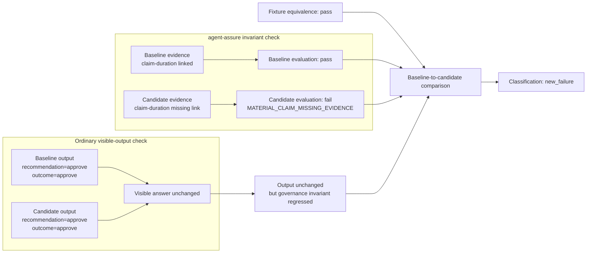
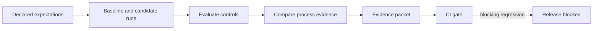

# agent-assure

[](https://pypi.org/project/agent-assure/)
[](https://pypi.org/project/agent-assure/)
[](https://github.com/acblabs/agent-assure/actions/workflows/ci.yml)
[](LICENSE)


**Catch agent process regressions that final-answer evals miss.**

`agent-assure` is a local-first process assurance toolkit for agentic AI
pipelines. It produces deterministic review artifacts and CI-gate signals when
a candidate agent preserves the visible decision but changes the governed
process around it.

> **Core thesis:** Output equivalence is not process equivalence.


<sub>Flagship evidence diff: the visible approval stayed stable, but the
material evidence trail regressed and the CI gate blocked the candidate.</sub>

## The 30-second story

The flagship demo compares a passing baseline with an evidence-normalization
candidate under the same deterministic fixtures:

```text
baseline:  recommendation=approve; outcome=approve
candidate: recommendation=approve; outcome=approve

decision fields: preserved
missing evidence link: claim-duration
classification: new_failure
CI gate: blocked as expected
```

The point is deliberately narrow and reviewable: the business decision did not
change, but the governed evidence path did. `agent-assure` catches that
process regression before release.

### Flagship regression at a glance

The diagram makes the gate logic explicit: fixture equivalence gates the
comparison, the visible answer stays stable, and the candidate still fails the
material evidence invariant.



## Start in one command

```bash
pip install agent-assure
agent-assure demo flagship
```

The demo runs offline with bundled deterministic fixtures. It writes local
review artifacts under `.tmp/demo/flagship` by default, including the generated
`evidence-diff.html` report previewed above as a PNG.

## For AI leaders

Use `agent-assure` when a team needs release-review evidence that an agent
change preserved declared expectations around the process, not just the answer.

- It makes hidden process regressions visible: evidence links, review routing,
  provider/tool boundaries, redaction behavior, retries, and provenance.
- It creates local evidence packets, Markdown reports, and a static HTML
  evidence diff that reviewers can inspect without a hosted governance
  platform.
- It complements answer-quality evals. Those evals ask whether the response is
  good; `agent-assure` asks whether the governed path to that response still
  matches the controls reviewers expected.

## For AI and security engineers

`agent-assure` is built around declared, observable controls:

- YAML suites and live protocols compile to strict JSON artifacts.
- Fixture mode runs baseline and candidate variants offline with no provider
  API key, network call, or token spend.
- Evaluators check expectations, policy controls, privacy filters, tool/provider
  boundaries, review routing, and material claim-evidence links.
- Baseline-to-candidate comparison runs after fixture equivalence passes, so
  verdicts are tied to controlled input material rather than incidental drift.
- Evidence packets bundle summaries, limitations, artifact digests, dependency
  inventory, environment context, and CI-gate state.
- CI commands exit nonzero on blocking findings, while the demo wrapper treats
  the known blocked candidate as a successful demonstration.

## What it produces

The flagship run writes reproducible local review artifacts:

- `.tmp/demo/flagship/demo-summary.json`
- `.tmp/demo/flagship/baseline-report/evaluation-report.md`
- `.tmp/demo/flagship/evidence-report/evaluation-report.md`
- `.tmp/demo/flagship/comparison-report/comparison-report.md`
- `.tmp/demo/flagship/ci-report/evidence-packet.json`
- `.tmp/demo/flagship/evidence-diff.html`

The evidence diff is a single local HTML file with inline CSS and escaped
dynamic content. It does not load external JavaScript, CSS, fonts, or network
resources.

## Architecture

At the highest level, `agent-assure` turns declared expectations into local
release-review evidence:



The broader toolkit includes YAML authoring, strict schemas, canonical digests,
fixture and live execution paths, privacy-filtered reporting, release replay,
and optional OpenTelemetry-aligned span-plan export. See
[`docs/architecture.md`](docs/architecture.md) for the implementation map.

## Five-minute fixture walkthrough

Run these commands one at a time from the repository root. The candidate
evaluation, comparison, and CI commands are expected to exit `1` after writing
their reports. See [`docs/showcase.md`](docs/showcase.md) for a GitHub Actions
snippet that asserts those expected failures in `set -e` contexts.

```bash
pip install -e ".[dev]"
mkdir -p .tmp/showcase
agent-assure suite compile examples/prior_auth_synthetic/suite.yaml --out .tmp/showcase/prior-auth.compiled.json --manifest .tmp/showcase/prior-auth.fixtures.json
agent-assure suite run .tmp/showcase/prior-auth.compiled.json --variant examples/prior_auth_synthetic/variants/baseline.yaml --manifest .tmp/showcase/prior-auth.fixtures.json --out .tmp/showcase/prior-auth.baseline.json
agent-assure suite run .tmp/showcase/prior-auth.compiled.json --variant examples/prior_auth_synthetic/variants/candidate_evidence_normalization.yaml --manifest .tmp/showcase/prior-auth.fixtures.json --out .tmp/showcase/prior-auth.evidence-candidate.json
agent-assure evaluate .tmp/showcase/prior-auth.baseline.json --suite .tmp/showcase/prior-auth.compiled.json --out-dir .tmp/showcase/baseline-report
agent-assure evaluate .tmp/showcase/prior-auth.evidence-candidate.json --suite .tmp/showcase/prior-auth.compiled.json --out-dir .tmp/showcase/evidence-report
agent-assure compare .tmp/showcase/prior-auth.baseline.json .tmp/showcase/prior-auth.evidence-candidate.json --suite .tmp/showcase/prior-auth.compiled.json --out-dir .tmp/showcase/comparison-report
agent-assure ci .tmp/showcase/prior-auth.evidence-candidate.json --suite .tmp/showcase/prior-auth.compiled.json --baseline .tmp/showcase/prior-auth.baseline.json --out-dir .tmp/showcase/ci-report --report-mode full
```

The baseline evaluation exits `0` and writes a `pass` summary with ten evaluated
cases and zero blocking findings. The candidate evaluation writes one blocking
finding for `shared-source-multi-claim` with reason code
`MATERIAL_CLAIM_MISSING_EVIDENCE`.

The comparison report classifies the change as `new_failure` under passing
fixture equivalence. For the failing case, the baseline and candidate both keep
`recommendation=approve; outcome=approve`; the material regression is the
missing `claim-duration` evidence link.

After reports exist, an evidence packet can also be built and gated from
summaries:

```bash
agent-assure packet build .tmp/showcase/evidence-report/evaluation-summary.json --comparison .tmp/showcase/comparison-report/comparison-summary.json --out .tmp/showcase/evidence-packet.json
agent-assure ci gate .tmp/showcase/evidence-packet.json
```

For this known failing candidate, both the CI command and packet gate are
expected to exit `1`. The CI command writes JSON/Markdown reports,
`evidence-packet.json`, `evidence-packet.md`, `dependency-inventory.json`,
`release-artifact-manifest.json`, and `ci-diagnostics.json`.

## Small generic example

The expense-approval example is a compact non-healthcare suite that uses the
same offline fixture and expectation method. It is a generic demonstration, not
a benchmark.

```bash
agent-assure suite compile examples/expense_approval_minimal/suite.yaml --out .tmp/expense.compiled.json --manifest .tmp/expense.fixtures.json
agent-assure suite run .tmp/expense.compiled.json --variant examples/expense_approval_minimal/variants/baseline.yaml --manifest .tmp/expense.fixtures.json --out .tmp/expense.baseline.json
agent-assure suite run .tmp/expense.compiled.json --variant examples/expense_approval_minimal/variants/candidate_provider_policy.yaml --manifest .tmp/expense.fixtures.json --out .tmp/expense.candidate.json
agent-assure evaluate .tmp/expense.baseline.json --suite .tmp/expense.compiled.json --out-dir .tmp/expense.baseline-report
agent-assure evaluate .tmp/expense.candidate.json --suite .tmp/expense.compiled.json --out-dir .tmp/expense.candidate-report
```

The baseline evaluation exits `0`. The provider-policy candidate is expected to
exit `1` with deterministic provider, outcome, and human-review control
findings.

## Schemas and development

Schema changes are versioned. Development work uses `schemas/unreleased/`.
Stable releases freeze a copy into `schemas/vX.Y.Z/`. The release gate verifies
the latest frozen schema directory, while schema staging exports the current
development schema surface to `schemas/unreleased/`.

From a repository checkout:

```bash
pip install -e ".[dev]"
git config core.hooksPath .githooks
python scripts/check_docs_alignment.py
ruff check .
mypy src scripts
pytest
python -m build
```

Dependency locking for release builds is documented in
[`docs/dependency_locking.md`](docs/dependency_locking.md). Release bundle
reproduction, SBOM generation, and cosign verification are documented in
[`docs/release_evidence.md`](docs/release_evidence.md).

The installed package includes bundled deterministic examples for reproducible
local demos. The top-level `examples/` tree mirrors those packaged resources
for repository-oriented docs and tests; `scripts/check_packaged_examples.py`
keeps the copies aligned. They are not a stable extension API; see
[`docs/api_surface.md`](docs/api_surface.md).

## Claim and trust boundary

`agent-assure` produces local review evidence, traceability, evidence mapping,
artifact digests, and CI-gate signals. It does not replace legal, regulatory,
clinical, provider-quality, model-quality, or business-impact review.

This project is not a compliance attestation.

It is not a safety claim.

Live results remain bounded by the declared protocol, data boundary,
provider/model configuration, and execution window. They are not general
model-quality, safety, or clinical-validation claims.

## Learn more

- [For AI leaders](docs/for_ai_leaders.md)
- [For engineers](docs/for_engineers.md)
- [What this measures](docs/what_this_measures.md)
- [Flagship demo](docs/demo_flagship.md)
- [Evidence diff](docs/evidence_diff.md)
- [Threat model](docs/threat_model.md)
- [Current claim boundary](docs/claim_boundary.md)
