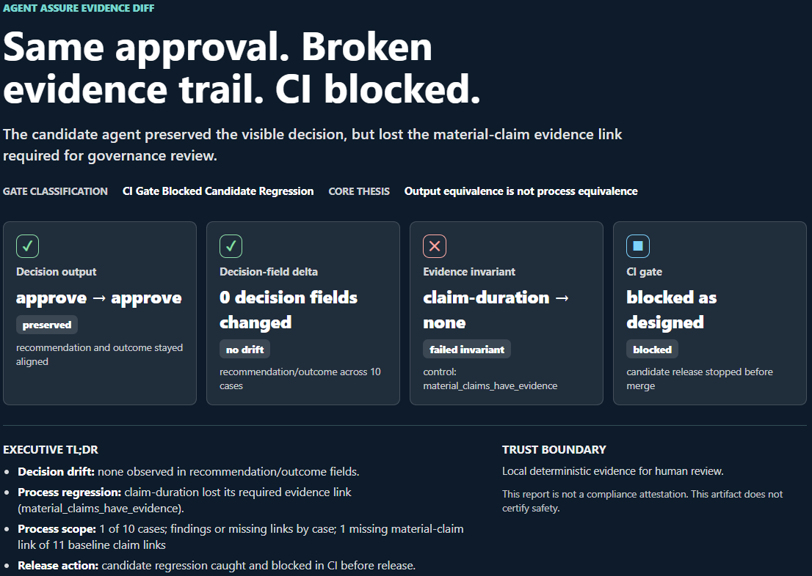
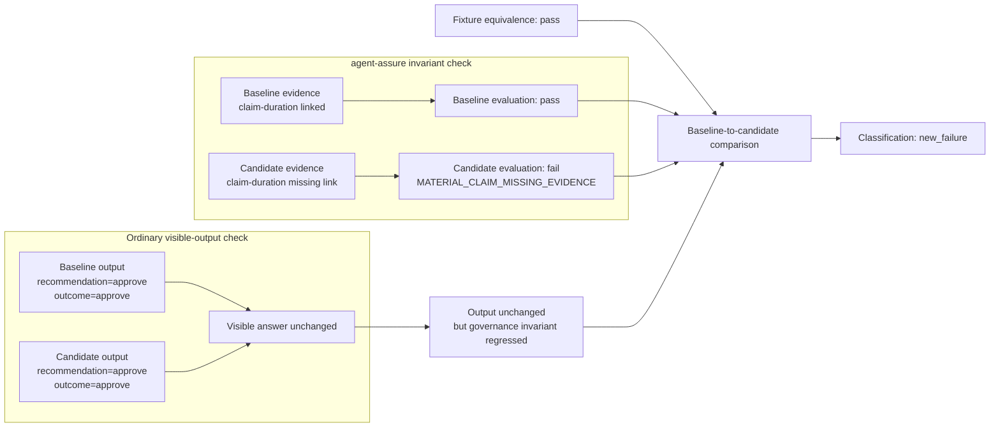
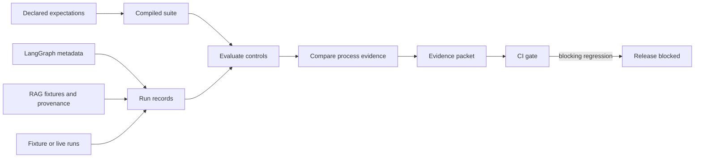

# agent-assure

<p align="center">
  <a href="#quickstart"><strong>Quickstart</strong></a> &middot;
  <a href="#integrations"><strong>Integrations</strong></a> &middot;
  <a href="docs/integrations/langgraph.md"><strong>LangGraph</strong></a> &middot;
  <a href="docs/demo_rag.md"><strong>RAG provenance</strong></a> &middot;
  <a href="docs/claim_boundary.md"><strong>Trust boundary</strong></a>
</p>

[](https://pypi.org/project/agent-assure/)
[](https://pypi.org/project/agent-assure/)
[](https://github.com/acblabs/agent-assure/actions/workflows/ci.yml)
[](LICENSE)


**Block agent process regressions that answer evals miss.**

`agent-assure` is a local-first process assurance toolkit for agentic AI
pipelines. It produces deterministic review artifacts and CI-gate signals when
a candidate agent preserves the visible decision but changes the governed
process, evidence path, RAG retrieval provenance, or framework workflow metadata
around it.

> **Core thesis:** Output equivalence is not process equivalence.

Teams shipping agent changes often discover too late that the answer stayed
the same while the evidence trail, retrieval sources, provider boundary, or
review route quietly changed.



<sub>Flagship evidence diff: the visible approval stayed stable, but the
material evidence trail regressed and the CI gate blocked the candidate.</sub>

## What it catches

`agent-assure` is built for the release-review gap between "the answer still
looks right" and "the governed process still matched the controls reviewers
expected."

| Surface | Regression it can make visible | Review signal |
| --- | --- | --- |
| Final answer checks | Candidate keeps `recommendation=approve; outcome=approve` while losing the evidence path | `new_failure` after fixture equivalence passes |
| LangGraph workflows | A graph update keeps the visible decision but drops required policy evidence or decision-node metadata | Privacy-filtered `agent_assure` metadata becomes evaluable run evidence |
| RAG retrieval | Same answer and same `retrieval_corpus_digest`, but the retrieved source backing a material claim disappears | `MATERIAL_CLAIM_MISSING_EVIDENCE` |
| RAG provenance drift | Evidence links stay intact, but the retrieval corpus digest changes | `provenance_only_change` for review, not a blocking finding |
| Boundaries and routing | Provider, tool, review route, or redaction state changes unexpectedly | Deterministic invariant findings |
| CI release gates | A blocking process invariant fails before merge or release | Nonzero exit code plus local evidence packet |

## The 30-second story

The flagship demo compares a passing baseline with an evidence-normalization
candidate under the same deterministic fixtures:

```text
baseline:  recommendation=approve; outcome=approve
candidate: recommendation=approve; outcome=approve

decision fields: preserved
missing evidence link: claim-duration
classification: new_failure
CI gate: blocked as expected
```

The point is deliberately narrow and reviewable: the business decision did not
change, but the governed evidence path did. `agent-assure` catches that process
regression before release.

The same evaluator model is used by the RAG provenance demo and LangGraph
adapter, so retrieval and graph-process regressions become reviewable in the
same packet-and-gate flow.

### Flagship regression at a glance

The diagram makes the gate logic explicit: fixture equivalence gates the
comparison, the visible answer stays stable, and the candidate still fails the
material evidence invariant.



## Quickstart

Run the flagship demo offline:

```bash
pip install agent-assure
agent-assure demo flagship
```

The demo runs with bundled deterministic fixtures. It writes local review
artifacts under `.tmp/demo/flagship` by default, including the generated
`evidence-diff.html` report previewed above as a PNG.

Try the RAG provenance demo:

```bash
agent-assure demo rag --out .tmp/demo/rag --clean
```

From a repository checkout, try the LangGraph expense-assurance example:

```bash
pip install "agent-assure[langgraph]"
python examples/langgraph_expense_assurance/run_example.py
```

If LangGraph is not installed, the example uses the same deterministic fallback
stream shape so adapter and evaluator behavior remain testable without network
calls or token spend.

Use it in GitHub Actions:

```yaml
name: agent-assure
on: [pull_request]

jobs:
  assure:
    runs-on: ubuntu-latest
    steps:
      - uses: actions/checkout@v4
      - uses: actions/setup-python@v5
        with:
          python-version: "3.11"
      - run: python -m pip install agent-assure==0.3.1
      - uses: acblabs/agent-assure/.github/actions/agent-assure@v0.3.1
        with:
          suite: examples/prior_auth_synthetic/suite.yaml
          baseline-variant: examples/prior_auth_synthetic/variants/baseline.yaml
          candidate-variant: examples/prior_auth_synthetic/variants/candidate_evidence_normalization.yaml
          report-mode: full
```

The composite action lives at
`.github/actions/agent-assure/action.yml`. Use `report-mode: full` when you
want complete review artifacts and `report-mode: fail-fast` when you want
shorter blocking feedback. Point `suite`, `baseline-variant`, and
`candidate-variant` at files in your repository; the paths above are this
project's bundled fixtures, shown as a runnable illustration. The bundled
candidate is expected to fail because it keeps the same visible decision while
dropping a material evidence link.

## Integrations

### LangGraph

Status: experimental.

The LangGraph adapter reads only privacy-filtered `agent_assure` metadata from
LangGraph events or streamed node updates. It ignores raw event `data.input`,
`data.output`, messages, completions, and tool arguments. Application nodes
emit compact labels or digests, then `agent-assure` converts those observations
into ordinary `AgentRunRecord` artifacts for the same evaluator used by fixture
and CI flows.

```python
{
    "agent_assure": {
        "case_id": "lg-exp-001",
        "event_type": "tool_call",
        "sequence_number": 2,
        "tool_name": "expense_policy_lookup",
        "evidence_refs": ["ref-expense-policy-v3"],
        "redaction_state": "redacted",
        "privacy_filtered_attributes": {
            "policy_version": "expense-policy-v3"
        },
    }
}
```

The included `examples/langgraph_expense_assurance` case keeps the same final
recommendation and review route across baseline and candidate. The candidate
omits the required policy evidence reference, so deterministic evaluation
blocks the process regression.

See [`docs/integrations/langgraph.md`](docs/integrations/langgraph.md) for the
adapter contract and current version notes.

### RAG provenance

The RAG demo stages a synthetic prior-authorization case with committed policy
chunks, a corpus manifest, scaled-integer cached vectors, retrieval outputs,
and counterfactual query-family fixtures.

```bash
agent-assure demo rag --out .tmp/demo/rag --clean
```

Expected punchline:

```text
output equivalence: preserved
retrieval corpus digest: unchanged
missing evidence link: claim-duration
classification: new_failure
CI gate: blocked as expected
```

The hero candidate keeps `recommendation=approve; outcome=approve` and the same
`retrieval_corpus_digest`, but drops the retrieved source supporting
`claim-duration`; the existing material-claim evidence invariant catches the
regression.

| Candidate shape | Decision | Corpus digest | Evidence links | Classification |
| --- | --- | --- | --- | --- |
| Reranker regression | Preserved | Unchanged | Missing `claim-duration` source | `new_failure` |
| Corpus-version skew | Preserved | Changed | Preserved | `provenance_only_change` |

The counterfactual query-family fixtures use committed query-vector keys and
report query digests rather than raw query text. They recompute retrieval
evidence support for authored variants; they do not prove semantic equivalence
between natural-language queries.

See [`docs/demo_rag.md`](docs/demo_rag.md) for the full demo boundary.

## How agent-assure is different

`agent-assure` is a local-first assurance layer designed for agentic AI release
review. It runs where engineering changes are already reviewed, writes evidence
into the caller's workspace, and can block a PR or release when a declared
process invariant fails.

| Common pattern | `agent-assure` approach |
| --- | --- |
| Dashboard waits for a human to notice drift | Local CLI writes review artifacts where the change is built |
| A separate platform owns the release workflow | `pip install` and a composite GitHub Action fit ordinary CI |
| Approval depends on manual dashboard review | Deterministic exit codes can block PRs or releases |
| Final-answer checks miss changed evidence paths | Process invariants check evidence, boundaries, routing, redaction, and provenance |
| Full-lifecycle governance platform required | Focused release-review evidence and CI gates |
| Code diffs or output similarity stand in for process review | Deterministic process invariants, plus protocol-bound stochastic review for live behavior |
| Artifacts stay in a hosted dashboard | Portable JSON, Markdown, static HTML, digests, and evidence packets stay in the workspace |
| Broad trust claims blur the boundary | Explicit boundary: measured evidence for human review |

Why it matters:

- **Local-first review:** teams can inspect evidence packets, Markdown reports,
  and static HTML diffs from the same workspace where the change was built.
- **CI-native release gates:** gate logic ships in the package and returns
  ordinary exit codes, so no external service decides pass or fail.
- **Process-aware regression checks:** a candidate can keep the same visible
  decision while losing evidence, changing review routing, or crossing a
  provider/tool boundary.
- **Protocol-bound live review:** when live provider behavior is involved,
  declared protocols preserve repeated observations, clustering, interval
  bounds, paired tests, drift summaries, and trajectory signals instead of
  relying only on deterministic diffs or output similarity.

## Who it is for

### AI leaders

An agent change can pass every answer-quality eval and still quietly stop
citing the policy that justified its decision. That regression may not show up
in a final-answer test; `agent-assure` turns silent process drift into a
blocking CI signal before release.

- **Hidden process drift:** surface lost evidence links, changed review routes,
  provider/tool boundary changes, redaction changes, retries, and provenance
  drift.
- **Release evidence:** produce evidence packets, Markdown reports, and static
  HTML evidence diffs reviewers can inspect, archive, or attach to release
  review.
- **Eval complement:** answer-quality evals ask whether the response is good;
  `agent-assure` asks whether the governed path to that response still matches
  declared controls.

### AI engineers

Use `agent-assure` when you need reproducible checks around agent pipelines,
framework integrations, and retrieval systems.

- **Strict artifacts:** compile YAML suites and live protocols into strict JSON
  artifacts.
- **Offline fixtures:** run baseline and candidate variants with no provider API
  key, network call, or token spend.
- **Controlled comparisons:** compare only after fixture equivalence passes, so
  verdicts are tied to controlled input material rather than incidental drift.
- **Shared run model:** project LangGraph metadata, fixture runs, and RAG
  provenance into the same run-record and evaluator model.

### AI security engineers

Use `agent-assure` when review needs to inspect observable controls without
persisting raw sensitive material in reports.

- **Observable controls:** check material claim-evidence links, provider/tool
  boundaries, review routing, redaction state, and policy controls.
- **Reviewable provenance:** inspect fixture manifest digests, retrieval corpus
  digests, source IDs, query digests, artifact digests, and dependency
  inventory.
- **Explicit boundary:** keep findings as release-review evidence, not safety,
  compliance, clinical, or provider-quality decisions.

## What it produces

The flagship run writes artifacts that reviewers can inspect, archive, attach
to release review, or upload from CI:

- `.tmp/demo/flagship/demo-summary.json`
- `.tmp/demo/flagship/baseline-report/evaluation-report.md`
- `.tmp/demo/flagship/evidence-report/evaluation-report.md`
- `.tmp/demo/flagship/comparison-report/comparison-report.md`
- `.tmp/demo/flagship/ci-report/evidence-packet.json`
- `.tmp/demo/flagship/evidence-diff.html`

The evidence diff is a single local HTML file with inline CSS and escaped
dynamic content. It does not load external JavaScript, CSS, fonts, or network
resources.

Evidence packets can also include summaries, limitations, artifact digests,
dependency inventory, environment context, release manifests, and CI-gate
state.

## Architecture

At the highest level, `agent-assure` turns declared expectations and observed
agent behavior into local release-review evidence:



The broader toolkit includes YAML authoring, strict schemas, canonical digests,
fixture and live execution paths, privacy-filtered reporting, release replay,
and optional OpenTelemetry-aligned span-plan export. See
[`docs/architecture.md`](docs/architecture.md) for the implementation map.

## Detailed walkthroughs

### Five-minute fixture walkthrough

The full command-by-command showcase lives in
[`docs/showcase.md`](docs/showcase.md). It compiles the synthetic
prior-authorization suite, runs baseline and candidate variants under identical
fixtures, evaluates both run sets, compares them, builds an evidence packet,
and shows the expected `new_failure` gate for the missing `claim-duration`
evidence link.

### Small generic example

The expense-approval example is a compact non-healthcare suite using the same
offline fixture and expectation method. See
[`docs/demo_expense.md`](docs/demo_expense.md) and
[`examples/expense_approval_minimal/`](examples/expense_approval_minimal/).

### Schemas and development

Schema changes are versioned. Development work uses `schemas/unreleased/`.
Stable releases freeze a copy into `schemas/vX.Y.Z/`. The release gate verifies
the latest frozen schema directory, while schema staging exports the current
development schema surface to `schemas/unreleased/`.

From a repository checkout:

```bash
pip install -e ".[dev]"
git config core.hooksPath .githooks
python scripts/check_docs_alignment.py
ruff check .
mypy src scripts
pytest
python -m build
```

Dependency locking for release builds is documented in
[`docs/dependency_locking.md`](docs/dependency_locking.md). Release bundle
reproduction, SBOM generation, and cosign verification are documented in
[`docs/release_evidence.md`](docs/release_evidence.md).

The installed package includes bundled deterministic examples for reproducible
local demos. The top-level `examples/` tree mirrors those packaged resources
for repository-oriented docs and tests; `scripts/check_packaged_examples.py`
keeps the copies aligned. They are not a stable extension API; see
[`docs/api_surface.md`](docs/api_surface.md).

## Claim boundary and what this is not

`agent-assure` produces local review evidence, traceability, evidence mapping,
artifact digests, and CI-gate signals. It does not replace legal, regulatory,
clinical, provider-quality, model-quality, or business-impact review.

This project is not a compliance attestation.

It is not a safety claim.

| `agent-assure` is | `agent-assure` is not |
| --- | --- |
| Release-review evidence for declared process expectations | A substitute for legal, regulatory, clinical, provider-quality, or business-impact review |
| A deterministic and protocol-bound measurement toolkit | A safety determination |
| A way to surface evidence, routing, redaction, boundary, and provenance regressions | A general model-quality benchmark |
| A local artifact and CI-gate workflow | A hosted governance platform or legal approval workflow |

Live results remain bounded by the declared protocol, data boundary,
provider/model configuration, and execution window. They are not general
model-quality, safety, or clinical-validation claims.

## Learn more

- **Audience:** [AI leaders](docs/for_ai_leaders.md) &middot; [Engineers](docs/for_engineers.md)
- **Demos:** [Flagship demo](docs/demo_flagship.md) &middot; [RAG provenance demo](docs/demo_rag.md)
- **Integrations:** [LangGraph integration](docs/integrations/langgraph.md)
- **Assurance model:** [What this measures](docs/what_this_measures.md) &middot; [Evidence diff](docs/evidence_diff.md)
- **Security and boundaries:** [Threat model](docs/threat_model.md) &middot; [Current claim boundary](docs/claim_boundary.md)
