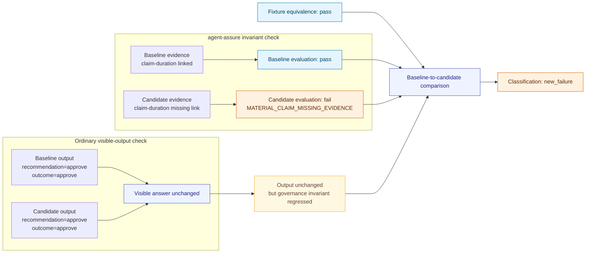
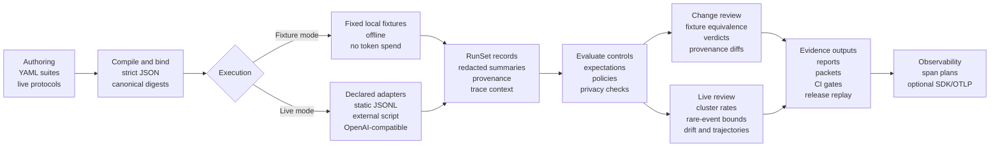

# agent-assure

Local-first process assurance for agentic AI pipelines.

**Core thesis:** Output equivalence is not process equivalence.

A candidate agent pipeline can return the same visible decision, approval,
denial, recommendation, or summary while silently changing material evidence,
review routing, provider/tool boundaries, redaction behavior, retries, or
provenance. `agent-assure` produces local evidence packets and CI gates so
reviewers can detect those observable process regressions. In the flagship
case, the output-equivalence claim is the narrower decision equivalence of
`recommendation` and `outcome`.

## Install

Install from PyPI and run the flagship demo:

```bash
pip install agent-assure
agent-assure demo flagship
```

The demo runs offline with bundled deterministic fixtures. It writes local
review artifacts under `.tmp/demo/flagship` by default.

## One-command demo

```text
Expected punchline:

output equivalence: preserved
missing evidence link: claim-duration
classification: new_failure
CI gate: blocked as expected
```

The baseline and candidate both keep
`recommendation=approve; outcome=approve`. The candidate still fails because it
drops the material evidence link for `claim-duration`.

## Claim boundary

`agent-assure` produces local review evidence, traceability, evidence mapping,
artifact digests, and CI-gate signals. It does not replace legal, regulatory,
clinical, provider-quality, model-quality, or business-impact review.

This project is not a compliance attestation. Safety review remains a separate
human and organizational responsibility.

## Schemas

Schema changes are versioned. Development work uses `schemas/unreleased/`.
Stable releases freeze a copy into `schemas/vX.Y.Z/`.
The release gate verifies the latest frozen schema directory, while schema
staging exports the current development schema surface to `schemas/unreleased/`.

## Local development

From a repository checkout:

```bash
pip install -e .
```

For validation checks, install the development extras:

```bash
pip install -e ".[dev]"
```

## Five-minute fixture walkthrough

Run these commands one at a time from the repository root. The final two
commands write reports and are expected to exit `1`; the GitHub Actions snippet
below shows how to assert those expected failures in `set -e` contexts.

```bash
pip install -e ".[dev]"
mkdir -p .tmp/showcase
agent-assure suite compile examples/prior_auth_synthetic/suite.yaml --out .tmp/showcase/prior-auth.compiled.json --manifest .tmp/showcase/prior-auth.fixtures.json
agent-assure suite run .tmp/showcase/prior-auth.compiled.json --variant examples/prior_auth_synthetic/variants/baseline.yaml --manifest .tmp/showcase/prior-auth.fixtures.json --out .tmp/showcase/prior-auth.baseline.json
agent-assure suite run .tmp/showcase/prior-auth.compiled.json --variant examples/prior_auth_synthetic/variants/candidate_evidence_normalization.yaml --manifest .tmp/showcase/prior-auth.fixtures.json --out .tmp/showcase/prior-auth.evidence-candidate.json
agent-assure evaluate .tmp/showcase/prior-auth.baseline.json --suite .tmp/showcase/prior-auth.compiled.json --out-dir .tmp/showcase/baseline-report
agent-assure evaluate .tmp/showcase/prior-auth.evidence-candidate.json --suite .tmp/showcase/prior-auth.compiled.json --out-dir .tmp/showcase/evidence-report
agent-assure compare .tmp/showcase/prior-auth.baseline.json .tmp/showcase/prior-auth.evidence-candidate.json --suite .tmp/showcase/prior-auth.compiled.json --out-dir .tmp/showcase/comparison-report
agent-assure ci .tmp/showcase/prior-auth.evidence-candidate.json --suite .tmp/showcase/prior-auth.compiled.json --baseline .tmp/showcase/prior-auth.baseline.json --out-dir .tmp/showcase/ci-report --report-mode full
```

The baseline evaluation exits `0` and writes a `pass` summary with ten evaluated
cases and zero blocking findings. The candidate evaluation is expected to exit
`1`; its report contains one blocking finding for
`shared-source-multi-claim` with reason code
`MATERIAL_CLAIM_MISSING_EVIDENCE`.

The comparison command is also expected to exit `1`. It writes
`.tmp/showcase/comparison-report/comparison-report.md` with classification
`new_failure` and fixture-equivalence state `pass`. For the failing case, the
baseline and candidate both keep `recommendation=approve; outcome=approve`; the
material regression is the missing `claim-duration` evidence link. See
`docs/showcase.md` for the expected report fields, GitHub Actions snippet, and
artifact digest summary.

After reports exist, an evidence packet can also be built and gated from
summaries:

```bash
agent-assure packet build .tmp/showcase/evidence-report/evaluation-summary.json --comparison .tmp/showcase/comparison-report/comparison-summary.json --out .tmp/showcase/evidence-packet.json
agent-assure ci gate .tmp/showcase/evidence-packet.json
```

For this known failing candidate, both the CI command and packet gate are
expected to exit `1`. The CI command writes JSON/Markdown reports,
`evidence-packet.json`, `evidence-packet.md`, `dependency-inventory.json`,
`release-artifact-manifest.json`, and `ci-diagnostics.json`.

Release evidence can be bundled and replayed from raw digests for stable source
artifacts and stable JSON projection digests for environment-bearing packet
artifacts:

```bash
python scripts/build_release_bundle.py --out .tmp/release --write-digests .tmp/release/release-digest-replay.json
agent-assure release replay .tmp/release/release-digest-replay.json --artifact-root . --require-current-commit
```

The release bundle includes the evidence packet, release manifest, replay file,
SBOM, source distribution, wheel, manifest-listed digest cross-checks, and
exact cosign-verifiable blobs when built by the release workflow. For keyless
cosign verification of workflow-signed release blobs, see
`docs/release_evidence.md`.

## What the demo shows

The flagship demo is intentionally narrow. It shows that a candidate can keep
the same visible answer while losing a material evidence link, and that the
evaluation report identifies the failing invariant under equivalent fixtures.
It is deterministic review evidence for a declared fixture, not a broad model
or provider assessment.

### Flagship regression at a glance

The key idea: output equivalence is not process equivalence. In the flagship
fixture, the candidate keeps the same visible recommendation and outcome as the
baseline, but drops a material evidence link. `agent-assure` catches the
missing evidence invariant and classifies the baseline-to-candidate comparison
as a `new_failure` under passing fixture equivalence.



## Architecture

This is the full toolkit shape. The five-minute demo exercises the fixture-mode
path and evidence outputs.



## Small generic example

The expense-approval example is a compact non-healthcare suite that uses the
same offline fixture and expectation method. It is a generic demonstration, not
a benchmark.

```bash
agent-assure suite compile examples/expense_approval_minimal/suite.yaml --out .tmp/expense.compiled.json --manifest .tmp/expense.fixtures.json
agent-assure suite run .tmp/expense.compiled.json --variant examples/expense_approval_minimal/variants/baseline.yaml --manifest .tmp/expense.fixtures.json --out .tmp/expense.baseline.json
agent-assure suite run .tmp/expense.compiled.json --variant examples/expense_approval_minimal/variants/candidate_provider_policy.yaml --manifest .tmp/expense.fixtures.json --out .tmp/expense.candidate.json
agent-assure evaluate .tmp/expense.baseline.json --suite .tmp/expense.compiled.json --out-dir .tmp/expense.baseline-report
agent-assure evaluate .tmp/expense.candidate.json --suite .tmp/expense.compiled.json --out-dir .tmp/expense.candidate-report
```

The baseline evaluation exits `0`. The provider-policy candidate is expected to
exit `1` with deterministic provider, outcome, and human-review control
findings.

## Current claim boundary

The project currently claims deterministic offline controls and
protocol-bound live operational evaluation implemented in this repository.
Public claims are tracked in
`docs/claims_traceability_matrix.yaml`.

A statistical protocol is documented in
`docs/measurement/experiment_protocol.md` for live stochastic evaluation. The
`agent-assure live` commands require a machine-readable protocol, run
explicitly configured adapters, and analyze repeated observations with
cluster-aware rates, protocol-declared comparison methods, and exploratory
guardrails for low cluster counts. Optional advanced endpoint plans bind
confirmatory/exploratory labels, Bonferroni multiplicity controls, rare-event upper
bounds, observed cluster-correlation summaries, and paired randomization-test
prerequisites to the protocol digest. Optional trajectory reports derive
privacy-filtered observable state paths, canonical transition profiles,
sequence invariants, and operational event-process summaries from structured
run artifacts. Live results remain bounded by the declared
protocol, data boundary, provider/model configuration, and execution window.
They are not general model-quality, safety, compliance, or clinical-validation
claims.

Synthetic calibration and regression coverage for the live statistical,
drift-monitoring, trajectory, and event-process paths is summarized in
`docs/live_calibration.md`.

The `external-script` live adapter runs configured scripts through a no-shell
subprocess harness and records redacted `emergency-process-record` artifacts
for process failures. It passes only declared environment allowlist entries,
explicit config variables, and runner-injected trace/request variables.
OpenTelemetry export is optional:

```bash
pip install -e ".[otel]"
agent-assure otel export RUNSET_OR_RECORD_OR_SPAN_PLAN.json --protocol otlp-http --endpoint http://localhost:4318/v1/traces
```

Exported spans are derived from span plans and structured run records, not live
SDK instrumentation of provider calls; raw prompts, raw outputs, tool
arguments, and unredacted summaries are not emitted.

## GitHub Actions snippet

```yaml
name: agent-assure-showcase
on: [push, pull_request]
jobs:
  flagship:
    runs-on: ubuntu-latest
    steps:
      - uses: actions/checkout@v4
      - uses: actions/setup-python@v5
        with:
          python-version: "3.11"
      - run: pip install -e ".[dev]"
      - run: mkdir -p .tmp/showcase
      - run: agent-assure suite compile examples/prior_auth_synthetic/suite.yaml --out .tmp/showcase/prior-auth.compiled.json --manifest .tmp/showcase/prior-auth.fixtures.json
      - run: agent-assure suite run .tmp/showcase/prior-auth.compiled.json --variant examples/prior_auth_synthetic/variants/baseline.yaml --manifest .tmp/showcase/prior-auth.fixtures.json --out .tmp/showcase/prior-auth.baseline.json
      - run: agent-assure suite run .tmp/showcase/prior-auth.compiled.json --variant examples/prior_auth_synthetic/variants/candidate_evidence_normalization.yaml --manifest .tmp/showcase/prior-auth.fixtures.json --out .tmp/showcase/prior-auth.evidence-candidate.json
      - run: agent-assure evaluate .tmp/showcase/prior-auth.baseline.json --suite .tmp/showcase/prior-auth.compiled.json --out-dir .tmp/showcase/baseline-report
      - name: Evaluate evidence candidate
        run: |
          set +e
          agent-assure evaluate .tmp/showcase/prior-auth.evidence-candidate.json --suite .tmp/showcase/prior-auth.compiled.json --out-dir .tmp/showcase/evidence-report
          status=$?
          set -e
          if [ "$status" -ne 1 ]; then
            echo "expected exit 1, got $status"
            exit 1
          fi
          grep -q "MATERIAL_CLAIM_MISSING_EVIDENCE" .tmp/showcase/evidence-report/evaluation-report.md
      - name: Compare baseline to candidate
        run: |
          set +e
          agent-assure compare .tmp/showcase/prior-auth.baseline.json .tmp/showcase/prior-auth.evidence-candidate.json --suite .tmp/showcase/prior-auth.compiled.json --out-dir .tmp/showcase/comparison-report
          status=$?
          set -e
          if [ "$status" -ne 1 ]; then
            echo "expected exit 1, got $status"
            exit 1
          fi
          grep -q 'Classification: `new_failure`' .tmp/showcase/comparison-report/comparison-report.md
          grep -q 'Fixture-Equivalence Result' .tmp/showcase/comparison-report/comparison-report.md
          grep -q 'State: `pass`' .tmp/showcase/comparison-report/comparison-report.md
```

## Development

```bash
git config core.hooksPath .githooks
python scripts/check_docs_alignment.py
ruff check .
mypy src scripts
pytest
python -m build
```

Dependency locking for release builds is documented in
`docs/dependency_locking.md`. Release bundle reproduction, SBOM generation, and
cosign verification are documented in `docs/release_evidence.md`.

The installed package includes bundled deterministic examples for reproducible
local demos. The top-level `examples/` tree mirrors those packaged resources
for repository-oriented docs and tests; `scripts/check_packaged_examples.py`
keeps the copies aligned. They are not a stable extension API; see
`docs/api_surface.md`.
