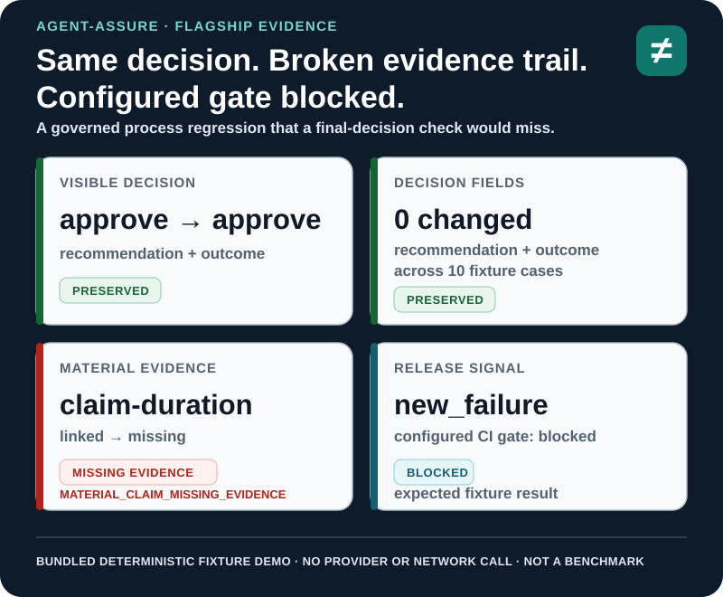
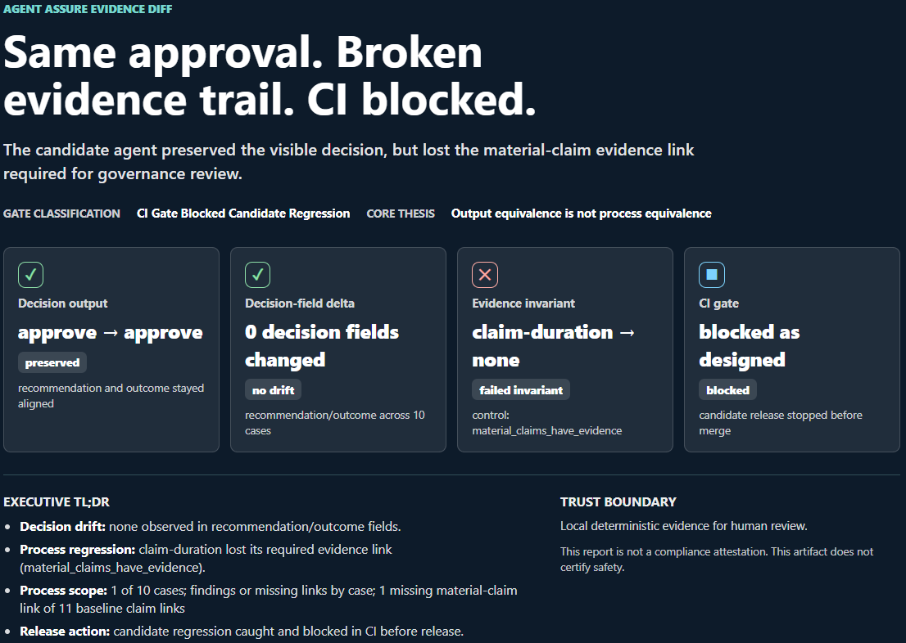
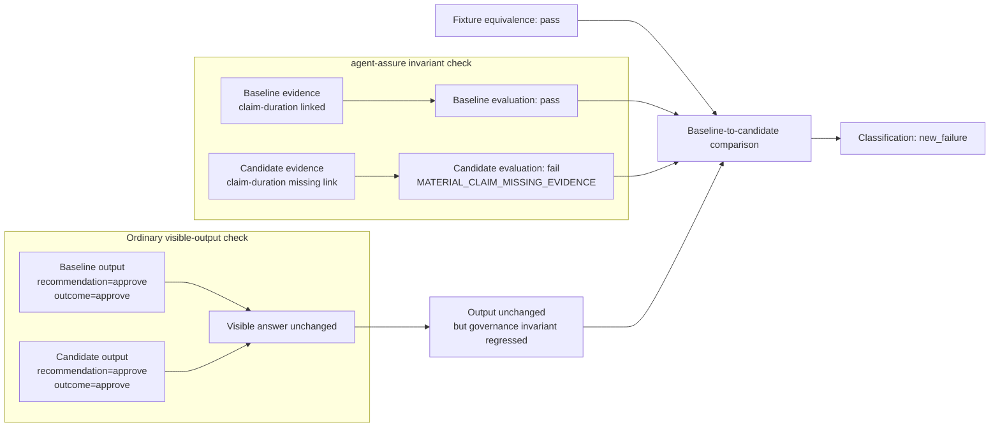
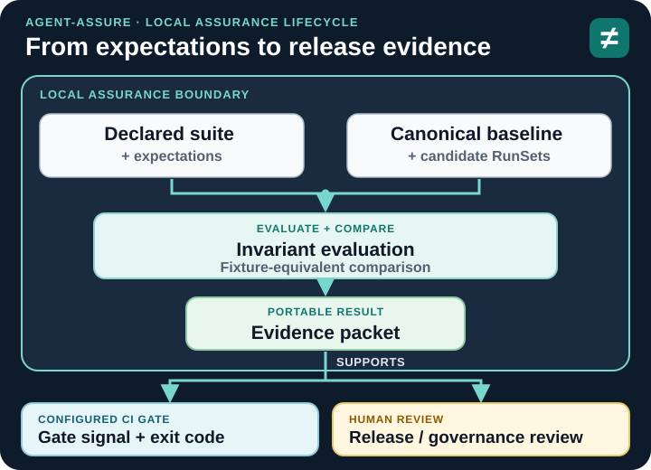

# agent-assure

## Output equivalence is not process equivalence.

**Same approval. Missing evidence link. Configured CI gate blocked.**

`agent-assure` catches declared, observable process regressions in agent
releases that final-answer-only checks can miss. It turns privacy-filtered run
evidence into reproducible comparisons, reviewer-facing artifacts, portable
evidence packets, and ordinary CI gate signals.

**Local-first · offline flagship demo · versioned artifacts · CI-native · no
hosted control plane required**

<p align="center">
  <a href="#quickstart"><strong>Run the offline demo</strong></a> &middot;
  <a href="#actual-reviewer-output"><strong>Inspect the reviewer output</strong></a>
</p>

<p align="center">
  <a href="docs/for_ai_leaders.md">For AI leaders</a> &middot;
  <a href="docs/architecture.md">For architects</a> &middot;
  <a href="docs/for_engineers.md">For engineers</a>
</p>

<p align="center">
  <a href="https://pypi.org/project/agent-assure/"></a>
  <a href="https://pypi.org/project/agent-assure/"></a>
  <a href="https://github.com/acblabs/agent-assure/actions/workflows/ci.yml"></a>
  <a href="LICENSE"></a>
  
</p>



`10 deterministic fixture cases` · `0 decision fields changed` ·
`claim-duration: linked → missing` · `classification: new_failure` ·
`configured CI gate: blocked`

> [!NOTE]
> This is a bundled deterministic fixture demonstration, not a model benchmark,
> live-model result, or customer outcome. It requires no provider API key,
> network call, or token spend.

[Read the flagship demonstration](docs/demo_flagship.md)

## Choose your path

| Your role | Start with the question that matters |
| --- | --- |
| **Chief AI Officers and release owners** | Did a release preserve its declared controls? See the local evidence and portable handoff for repeatable review. [Read the AI leader brief](docs/for_ai_leaders.md). |
| **AI/ML architects and platform owners** | Where does it fit, what crosses the trust boundary, and which contracts are stable? [Review the architecture](docs/architecture.md) · [Inspect the API surface](docs/api_surface.md). |
| **AI/ML engineers** | How do I turn observable expectations and privacy-filtered run records into a configured CI decision? [Follow the engineering guide](docs/for_engineers.md). |

## What it can surface

A final-answer-only check can see no decision-field change while a declared
release expectation regresses:

- **Evidence and RAG support:** a required source or material claim-to-evidence
  link disappears, or declared corpus and retrieval identity changes. Example:
  `MATERIAL_CLAIM_MISSING_EVIDENCE → new_failure`.
- **Human review:** a required route or performed-review record is missing.
- **Provider, tool, and privacy boundaries:** a forbidden provider or tool
  appears, or declared route, redaction state, or detector identity changes.
- **Usage and reliability:** retries, tool calls, tokens, latency, rate-limit
  events, or declared estimated cost change materially.
- **Streaming integrity:** events are replayed, duplicated, conflicting, or
  outside the declared sequence contract.
- **Protocol-bound live behavior:** repeated observations drift outside a
  declared protocol or comparison boundary.

A surfaced difference may be blocking, review-only, or informational. Usage
and reliability deltas block only when a suite or policy declares that
behavior.

## Quickstart

Requires Python 3.11 or newer.

```bash
pip install agent-assure
agent-assure demo flagship --out .tmp/demo/flagship --clean
```

The installed package runs the bundled deterministic fixture from any
directory—no repository clone, provider API key, network call, or token spend.

```text
output equivalence: preserved
missing evidence link: claim-duration
reason code: MATERIAL_CLAIM_MISSING_EVIDENCE
classification: new_failure
CI gate: blocked as expected
```

The demo wrapper exits `0` only when it verifies that the expected regression
was caught. The underlying candidate evaluation, comparison, and CI commands
remain strict and exit nonzero for the blocking finding.

### Actual reviewer output

<a href="docs/assets/flagship-evidence-diff.png">
  
</a>

<p align="center"><sub>Screenshot of the reviewer-facing
<code>evidence-diff.html</code> produced from the same bundled fixture. Open the
image to inspect it at full resolution.</sub></p>

### Reviewer-facing artifacts

Key artifacts are written under `.tmp/demo/flagship`:

| Artifact | Review purpose |
| --- | --- |
| `demo-summary.json` | Machine-readable demonstration result |
| `baseline-report/evaluation-summary.json` | Baseline behavior against declared expectations |
| `comparison-report/comparison-summary.json` | Controlled baseline-to-candidate classification |
| `ci-report/evidence-packet.json` | Portable machine-readable review handoff |
| `evidence-diff.html` | Self-contained human-readable evidence diff |

<details>
<summary><strong>How this README evidence view is verified against the fixtures</strong></summary>

### Flagship regression at a glance

This diagram is checked in CI against the bundled flagship fixtures, keeping
README claims aligned with the evidence produced by the project itself.


```mermaid
flowchart LR
    subgraph OutputCheck["Ordinary visible-output check"]
        BOut["Baseline output<br/>recommendation=approve<br/>outcome=approve"]
        COut["Candidate output<br/>recommendation=approve<br/>outcome=approve"]
        Same["Visible answer unchanged"]
        BOut --> Same
        COut --> Same
    end

    subgraph InvariantCheck["agent-assure invariant check"]
        BEv["Baseline evidence<br/>claim-duration linked"]
        CEv["Candidate evidence<br/>claim-duration missing link"]
        Pass["Baseline evaluation: pass"]
        Fail["Candidate evaluation: fail<br/>MATERIAL_CLAIM_MISSING_EVIDENCE"]
        BEv --> Pass
        CEv --> Fail
    end

    Same --> Tension["Output unchanged<br/>but governance invariant regressed"]
    Equiv["Fixture equivalence: pass"] --> Compare["Baseline-to-candidate comparison"]
    Pass --> Compare
    Fail --> Compare
    Tension --> Compare

    Compare --> NewFailure["Classification: new_failure"]
```

</details>

## Where it fits

`agent-assure` complements the evaluation, observability, runtime-control, and
governance systems teams already use.

| Layer | Primary question | Relationship to `agent-assure` |
| --- | --- | --- |
| **Output and agent evals** | Does the answer, trajectory, tool use, or component meet its quality criteria? | Adds checks for declared, observable process expectations. |
| **Observability and tracing** | What happened during execution? | Consumes versioned, privacy-filtered evidence; it is not a telemetry backend. |
| **Runtime guardrails** | What must change or stop during a request? | Evaluates at release time; it is not runtime enforcement. |
| **Governance and GRC systems** | Which policies, approvals, and accountabilities apply? | Supplies review evidence; it is not a system of record and does not determine compliance. |
| **`agent-assure`** | Did a controlled candidate preserve declared process expectations? | Evaluates, compares when equivalent, packetizes, and returns a CI signal. |

It is a particularly strong fit when release review must be local,
reproducible, CI-enforceable, and traceable without a required hosted control
plane.

## How it works

```text
Declare → Observe (privacy-filtered) → Evaluate
        → Compare (when equivalent) → Packet → Gate
```

Declared expectations and canonical run evidence remain distinct. The
candidate is evaluated first; equivalent-baseline context is added only after
comparison prerequisites pass. The evidence packet then supports a CI signal
and human release review.

`agent-assure` is a local-first Agent Release Assurance Compiler: controls and
evidence stay bound to method identity, prerequisites, provenance, assumptions,
and limitations.



The assurance model is deliberately bounded:

- **Deterministic and reproducible in fixture mode:** fixed, versioned fixtures,
  canonical serialization, schemas, and digest-bound manifests make checks
  repeatable; that reproducibility does not estimate production prevalence.
- **Scoped invariance claims:** results cover only declared, observable fields
  and explicit prerequisites—not hidden reasoning or all production behavior.
- **Traceable lineage:** expectations connect to RunSets, findings, comparisons,
  evidence packets, and configured gate state; provenance records participating
  material.
- **Fail-closed:** malformed, conflicting, incompatible, ambiguous, or unbound
  evidence does not silently become a passing review.
- **Statistically bounded:** live conclusions about probabilistic provider
  behavior remain tied to a declared statistical protocol, with its data
  boundary, configuration, window, sampling noise, dependence, and limitations
  explicit.

Architecture choices and evidence boundaries are documented in
[architectural decision records (ADRs)](docs/adr/), including deterministic
fixture versus stochastic live semantics.

## Challenge the assurance controls

The development-RFC `core/v1` mutation catalog runs seven deterministic
challenges across evidence linkage, human-review routing, tool boundaries,
provenance identity, privacy redaction, duplicate replay, and budget-stop
integrity:

```bash
agent-assure controls mutate \
  --suite assurance/suite.yaml \
  --runset runs/baseline.json \
  --catalog core/v1 \
  --seed 0 \
  --today 2026-08-02 \
  --full-report \
  --out reports/control-challenge
```

Every selected operator runs independently against the same immutable source.
The output binds the canonical catalog digest, normative expected detector,
observed and prohibited substitute findings, exact changed paths, provenance,
independence class, seed, and limitations. It is a finite challenge report,
not a safety score, mutation kill rate, statistical confidence interval, or
universal-coverage claim.

[Inspect the exact seven-operator catalog](docs/mutation_catalog.md) ·
[Review the evidence contracts](docs/evidence_carrying_releases.md)

## Integrate your agent

`agent-assure` integrates through declared YAML expectations, versioned run
evidence, the documented CLI, and the framework-neutral `AgentRunRecord`
producer contract.

| You provide | `agent-assure` does | You receive |
| --- | --- | --- |
| Declared expectations, a candidate RunSet, and an optional equivalent baseline RunSet | Validate, evaluate, compare when equivalence prerequisites pass, packetize, and apply the configured gate | Evaluation and comparison summaries, `evidence-packet.json`, human-readable reports, and an ordinary CI exit status |

The integration contract has three parts:

1. Declare observable process expectations in YAML.
2. Produce versioned run records from fixtures or privacy-filtered observations.
3. Evaluate the candidate, compare equivalent baseline evidence when available,
   and gate the resulting evidence packet.

A real expectation from the bundled flagship suite:

```yaml
cases:
  - case_id: shared-source-multi-claim
    fixture_id: shared-source-multi-claim
    expectation:
      expected_recommendation: approve
      required_evidence_refs:
        - ref-shared-clinical-note
      material_claim_ids:
        - claim-eligibility
        - claim-duration
```

`agent-assure` does not infer material claims from rationale text. Authors
declare the oracle, and run-record producers emit explicit claim-to-evidence
links for the material claims they intend to satisfy.

[Author expectations](docs/expectation_authoring.md) ·
[Understand the CLI contract](docs/cli_contract.md) ·
[Review the public API surface](docs/api_surface.md) ·
[Understand evidence packets](docs/evidence_packets.md)

<details>
<summary><strong>GitHub Actions example using the bundled fixture</strong></summary>

Pin both the package and composite action in release workflows. Replace the
example suite and variant paths with your own controlled materials.

```yaml
name: agent-assure
on: [pull_request]

jobs:
  assure:
    runs-on: ubuntu-latest
    steps:
      - uses: actions/checkout@v4
      - uses: actions/setup-python@v5
        with:
          python-version: "3.11"
      - run: python -m pip install agent-assure==0.6.1
      - uses: acblabs/agent-assure/.github/actions/agent-assure@v0.6.1
        with:
          suite: examples/prior_auth_synthetic/suite.yaml
          baseline-variant: examples/prior_auth_synthetic/variants/baseline.yaml
          candidate-variant: examples/prior_auth_synthetic/variants/candidate_evidence_normalization.yaml
          report-mode: full
```

`full` produces the complete review artifacts; `fail-fast` gives shorter
blocking feedback. The configured gate follows declared expectations and
policies, the selected gate profile, and explicit strictness flags.
The composite action uploads only the packet, manifest, summaries, and CI
diagnostics by default. Set `upload-full-artifacts: "true"` only when the
workflow is approved to retain compiled suites, fixture data, and RunSets; the
default retention period is 14 days.

</details>

## Integrations and maturity

**Current maturity: Release Candidate (RC, `v0.6.1`).**

The CLI, YAML authoring format, persisted versioned JSON artifacts, and
`AgentRunRecord` producer contract are the primary integration surface.
Framework adapters, streaming, and live execution remain experimental.
The RC label applies only to the primary surface; development-RFC contracts
remain non-stable. PyPI's `Development Status :: 4 - Beta` is the closest
standardized classifier to an RC and does not widen that surface.

| If you have… | Start with… | Maturity |
| --- | --- | --- |
| YAML suites or versioned JSON artifacts | [CLI contract](docs/cli_contract.md) | Primary supported surface |
| A GitHub release workflow | [Composite action](.github/actions/agent-assure/action.yml) | Packaged and documented |
| Deterministic mutation operators and closed catalog campaigns | [Core mutation catalog](docs/mutation_catalog.md) · [Evidence-carrying releases](docs/evidence_carrying_releases.md) | Development RFC |
| RAG retrieval evidence | [RAG provenance demo](docs/demo_rag.md) | Reference implementation |
| JSONL or multi-agent events | [Streaming example](examples/streaming_process_regression/README.md) | Experimental |
| LangGraph or Google ADK events | [LangGraph](docs/integrations/langgraph.md) · [Google ADK](docs/integrations/google_adk.md) | Experimental |
| Live provider or external-script subjects | [Adapter contract](docs/adapters/adapter_contract.md) | Experimental, time-bound evidence |
| OpenTelemetry context or export | [OpenTelemetry alignment](docs/otel_alignment.md) | Optional alignment only |

<details>
<summary><strong>Experimental streaming semantics</strong></summary>

Here, idempotency refers only to idempotent deduplication for stable
at-least-once redeliveries. Conflicting duplicates fail closed; deterministic
sorting prevents out-of-order arrival jitter from changing the persisted
trajectory.

</details>

Framework adapters project only privacy-filtered `agent_assure` metadata into
the framework-neutral run-record model. They ignore raw prompts, messages,
completions, tool arguments, token chunks, and unredacted summaries.

## Governance crosswalks

Packet-resident evidence can be mapped to selected concepts in the
[NIST AI RMF](docs/governance_crosswalk_nist_ai_rmf.md),
[OWASP Top 10 for LLM Applications 2025](docs/governance_crosswalk_owasp_llm.md),
[ISO/IEC 42001](docs/governance_crosswalk_iso42001.md), and
[MITRE ATLAS 2026.06](docs/governance_crosswalk_mitre_atlas.md).

These crosswalks are planning and review aids. They do not establish framework
conformance, complete coverage, third-party assurance, or endorsement.

## Claim boundary

> **Measured evidence, not a blanket trust claim.**

This project is not a compliance attestation.

Generated artifacts make declared inputs, findings, limitations, and gate state
traceable and auditable for human review. Whether the release decision is
defensible remains a human and organizational judgment. `agent-assure` does not
determine safety or replace domain, legal, regulatory, clinical, security,
provider-quality, model-quality, or business-impact review.

| `agent-assure` is | `agent-assure` is not |
| --- | --- |
| Release-review evidence for declared process expectations | A legal or regulatory determination |
| A deterministic and protocol-bound measurement toolkit | A safety determination |
| A way to surface evidence, routing, privacy, boundary, provenance, usage, and stream-integrity regressions | A general model-quality benchmark |
| A local artifact and CI-gate workflow | A production observability backend or enterprise governance system of record |
| An engineering evidence source for human and governance review | A replacement for organizational accountability |

Pattern redaction is a guardrail, not comprehensive DLP or de-identification.
Live conclusions remain bounded by the declared protocol, data boundary,
provider/model configuration, and execution window. Review the
[claim boundary](docs/claim_boundary.md), [limitations](docs/limitations.md),
[threat model](docs/threat_model.md), [privacy model](docs/privacy_model.md),
and [security guidance](SECURITY.md).

## Learn more

- **Start:** [Documentation](docs/index.md) · [For AI leaders](docs/for_ai_leaders.md) · [For architects](docs/architecture.md) · [For engineers](docs/for_engineers.md)
- **Demos:** [Flagship](docs/demo_flagship.md) · [RAG provenance](docs/demo_rag.md) · [Expense approval](docs/demo_expense.md)
- **Integrations:** [LangGraph](docs/integrations/langgraph.md) · [Google ADK](docs/integrations/google_adk.md) · [Adapter contract](docs/adapters/adapter_contract.md)
- **Assurance:** [What this measures](docs/what_this_measures.md) · [Evidence packets](docs/evidence_packets.md) · [Live calibration](docs/live_calibration.md)
- **Evidence-carrying releases:** [Core mutation catalog](docs/mutation_catalog.md) · [Contracts and campaign guide](docs/evidence_carrying_releases.md) · [Architecture](docs/architecture.md) · [CLI contract](docs/cli_contract.md)
- **Security and governance:** [Claim boundary](docs/claim_boundary.md) · [Threat model](docs/threat_model.md) · [Governance crosswalks](docs/threat_coverage_matrix.yaml)
- **Project:** [Contributing](CONTRIBUTING.md) · [Changelog](CHANGELOG.md) · [License](LICENSE)

<details>
<summary><strong>Development from a repository checkout</strong></summary>

```bash
pip install -e ".[dev]"
git config core.hooksPath .githooks
python scripts/check_docs_alignment.py
ruff check .
mypy src scripts
pytest
python -m build
```

</details>

## Citing

This project ships a [`CITATION.cff`](CITATION.cff). Use GitHub’s
**Cite this repository** control for generated citation formats.
